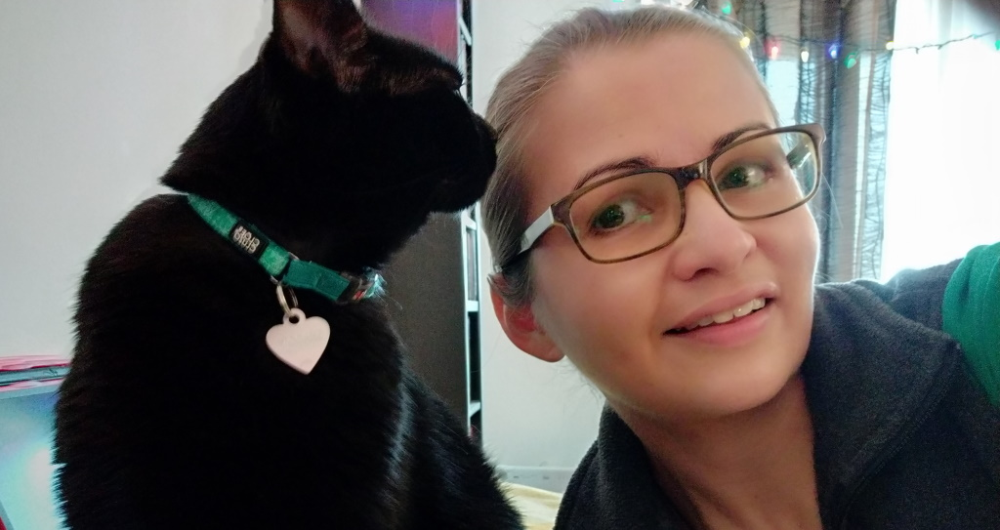

## SERVICE DE GARDIENNAGE AVEC VISITES À VOTRE DOMICILE POUR LES CHATS DU TRIANGLE (MONTRÉAL, CDN) 

J’habite le secteur du Triangle à Montréal. Je privilégie les gardes proches de chez moi. J'ai surtout de l’expérience avec les chats mais je suis aussi intéressée pour d'autres animaux : chiens saucisses (seulement), oiseaux, lapins, animaux exotiques. 
Je suis inscrite sur Pawshake qui est une plateforme permettant de mettre en relation gardiens et clients pour rendre un service de gardiennage pour animaux de compagnie. 

Ma force est le temps que j’accorde à vos animaux de compagnie. J’aime jouer avec eux, j’aime créer un lien ! Que votre chat soit timide ou joueur, je m’adapterai à sa personnalité car mon but est de rendre ma visite positive pour l’animal et que le client soit satisfait à son retour. Partez l’esprit tranquille, vous recevrez des nouvelles et des photos régulièrement de vos petits amours !

&nbsp;

## MES SERVICES
* Première rencontre pour voir l'animal et discuter de ses besoins, remise des clés et finalisation de la réservation. 
* Visites : une visite par jour d'1h
* Nettoyage de la litière
* Nourriture sèche, humide et, eau.
* Câlins
* Brossage mais pas de toilettage ni coupe de griffes
* Jeux
* Pas de médication (sauf si l'animal a l'habitude de se laisser faire), pas d'injection.
* Ramassage du courrier
* Arrosage des plantes
* Aération du domicile
* Achat de nourriture seulement et si besoin (Remboursement des achats avec ticket de caisse via virement Interac ou argent comptant laissé lors de la première rencontre en prévoyance d’achats à faire)
* Rapport après chaque visite avec photos 
* Possibilité d’organiser une visioconférence (via Meet, Zoom ou Teams) pour voir votre animal en direct durant votre absence
* Retour des clés au client ou arrangement pour les laisser dans un endroit sécuritaire ou à un concierge (directement à lui ou dans sa boîte aux lettres par exemple)
* Pourboires acceptés en argent comptant ou par virement Interac

Vous pouvez consulter mon profil et les appréciations de mes clients en vous rendant à [Pawshake.ca](https://fr.pawshake.ca/garde-animaux/montreal-qc/les-chats-du-triangle-cdn-3785857).

&nbsp;

## TARIFS, PRISE DE RENDEZ-VOUS ET PAIEMENT 
**Seulement** par la plateforme de réservation [Pawshake.ca](https://fr.pawshake.ca/garde-animaux/montreal-qc/les-chats-du-triangle-cdn-3785857). 

&nbsp;

## COURS/CONFÉRENCES 
* Cours de premiers soins pour animaux de compagnie (6 avril 2019), une journée de formation au DMV Montréal, attestation d’ambulance Saint-Jean.
* Cours sur le comportement félin et canin à la maison, clinique, pension et au refuge (avril 2020), Marine Cassoret, Ph.D, Ethologue, AZCA.
* Comment et pourquoi être une clinique Cat Friendly (1er mai 2020), conférence en ligne Éduchateur.
* Introduction aux bienfaits du massage pour les chiens (13 mai 2020), Mondou, Facebook Live.
* Course Animal behaviour and welfare : dogs, cats, poultry, pigs, cows, zoo animals (mai/juin 2020), Coursera, Université d’Édimbourg, Écosse/R-U.
* Intelligence, perceptions et émotions du chat (2 et 9 juillet 2020), conférence en ligne Chatvoir – Éduchateur
* Communications, agressions et mythes (30 juillet et 6 août 2020), conférence en ligne Chatvoir – Éduchateur
* Tout savoir pour un chat sans problème (3 et 10 décembre 2020), conférence en ligne Chatvoir – Éduchateur
* Conférence sur l'intelligence des poissons (23 avril 2021), Sébastien Moro, Vulgarisateur scientifique dans le domaine de la cognition animale. 

&nbsp;

## BÉNÉVOLAT
* Bénévolat à la SPCA de Montréal (janvier à mars 2020), affectation au programme de socialisation des chats : application des différentes techniques de socialisation afin de maximiser leur potentiel d’adoption. Nettoyage des cages, bols, litières, couvertures, jouets, en respectant les normes de biosécurité au sein d’un refuge.

* Bénévolat au Nichoir, refuge pour oiseaux sauvages à Hudson (juillet à septembre 2020) : nettoyage des volières des passereaux et des volières aquatiques des oies et des canards. Préparation et distribution de la nourriture aux oiseaux en respectant leur diète. Observations et reports de toutes anomalies au personnel du refuge.

&nbsp;

Merci d’avance pour votre confiance et au plaisir de vous rencontrer, vous et votre animal de compagnie !

*STÉPHANIE*

